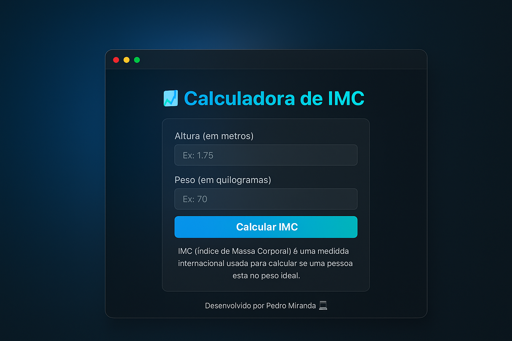

# 📊 Calculadora de IMC

Uma aplicação web simples e moderna para calcular o **Índice de Massa Corporal (IMC)**, desenvolvida com **HTML, CSS e JavaScript**.  
O objetivo é ajudar o usuário a descobrir se está dentro do peso ideal de forma rápida e visualmente agradável.

---

## 🖼️ Preview

### 💻 Versão Desktop

### 📱 Versão Mobile

---

## 🚀 Tecnologias Utilizadas

- HTML5  
- CSS3 (com animações e responsividade)  
- JavaScript (DOM e eventos)  

---

## 🚀 Funcionalidades

- Entrada de **altura** e **peso** com validação.  
- Cálculo automático do **IMC**.  
- Exibição dinâmica da categoria correspondente:
  - Abaixo do peso  
  - Peso normal  
  - Sobrepeso  
  - Obesidade  
  - Obesidade grave  
- Cores e animações diferentes conforme o resultado.  
- Permite calcular pressionando **Enter**.  

---

## 🧠 Como usar

1. Insira sua **altura (em metros)** e **peso (em kg)** nos campos correspondentes.  
2. Clique em **"Calcular IMC"** ou pressione **Enter**.  
3. O resultado aparecerá com a categoria e o valor do seu IMC.

---

## 🧩 Estrutura do Projeto

calculadora-imc/
│
├── index.html
├── css/
│ └── style.css
├── js/
│ └── script.js
└── assets/
├── preview-desktop.png
└── preview-mobile.png

---

## 🛠️ Tecnologias Utilizadas

- **HTML5** – Estrutura da página  
- **CSS3** – Estilos e animações  
- **JavaScript (puro)** – Lógica e interatividade  

---

## 💡 Exemplo de uso

1. Abra o arquivo `index.html` no navegador.  
2. Digite sua **altura em metros** no primeiro campo.  
   - Exemplo: `1.75`
3. Digite seu **peso em quilogramas** no segundo campo.  
   - Exemplo: `70`
4. Clique em **"Calcular IMC"** (ou pressione **Enter**).  
5. O resultado será exibido logo abaixo do botão, indicando:
   - Seu **IMC numérico** (ex: 22.86)  
   - Sua **categoria** (ex: “Peso normal”)  
6. O fundo do resultado muda de cor conforme a categoria:
   - 🩵 Azul claro → abaixo do peso  
   - 💚 Verde → peso normal  
   - 💛 Amarelo → sobrepeso  
   - 🧡 Laranja → obesidade  
   - ❤️ Vermelho → obesidade grave  
---

## 🧑‍💻 Desenvolvido por

** [Pedro Miranda](https://github.com/pedro2506)**  
📧 Email: t3pedropaulo@gmail.com
💬 Projeto criado com fins educacionais e para portfólio.  
📅 Criado em **Novembro de 2025**  

---

## 🪪 Licença

Este projeto está sob a licença **MIT**.  
Você é livre para usar e modificar o código, desde que mantenha os créditos ao autor.

---

